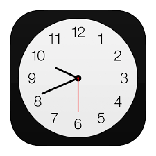

<a name="readme-top"></a>
# Watch Time Android Application


<!-- ABOUT THE PROJECT -->
### About The Project
1. Description
   
2. Implementation <a name="implementation"></a>
<pre><code>
  implementation 'androidx.appcompat:appcompat:1.4.2'
  implementation 'com.google.android.material:material:1.6.1'
  implementation 'androidx.constraintlayout:constraintlayout:2.1.4'
  implementation 'androidx.lifecycle:lifecycle-livedata-ktx:2.3.1'
  implementation 'androidx.lifecycle:lifecycle-viewmodel-ktx:2.3.1'
  implementation 'androidx.navigation:navigation-fragment:2.5.0'
  implementation 'androidx.navigation:navigation-ui:2.5.0'
  testImplementation 'junit:junit:4.13.2'
  androidTestImplementation 'androidx.test.ext:junit:1.1.3'
  androidTestImplementation 'androidx.test.espresso:espresso-core:3.4.0'
  implementation 'com.squareup.retrofit2:retrofit:2.9.0'
  implementation 'com.google.code.gson:gson:2.9.0'
  implementation 'com.squareup.retrofit2:converter-gson:2.3.0'
  def room_version = "2.4.3"
  // https://mvnrepository.com/artifact/jakarta.annotation/jakarta.annotation-api
  implementation 'jakarta.annotation:jakarta.annotation-api:2.1.1'
  implementation "androidx.room:room-runtime:$room_version"
  annotationProcessor "androidx.room:room-compiler:$room_version"
</code></pre>

### Built With

* 
* 

<p align="right">(<a href="#readme-top">back to top</a>)</p>

### Installation

1. Clone the repo
   ```sh
   git clone https://github.com/sonnguyen1510/Watch_Time_AndroidApp.git
   ```
2. Implement library needed for this project (<a href="#implementation">Click here</a>) , check JDK , SDK version before run 
   

<p align="right">(<a href="#readme-top">back to top</a>)</p>


